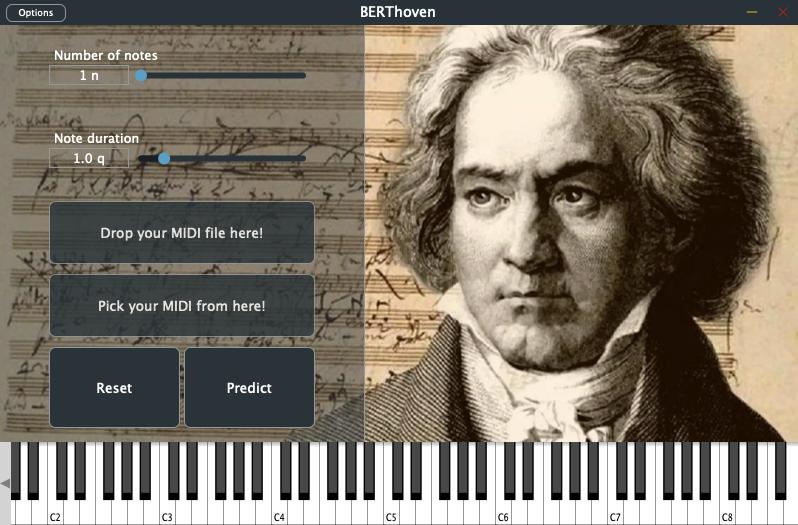

# _BERThoven_
This is the official repository for BERThoven, a melody generator plugin that leverages Google's BERT (Bidirectional Encoder Representations from Transformers) model. 

## The Project's Objective
The project's primary objectives are both to develop a user-friendly and intuitive plugin that can seamlessly integrate with popular digital audio workstations (DAWs) and to provide a meaningful study of the underlying melody generation deep neural model based on transformers. BERThoven incorporates the BERT model, a transformer-based neural network architecture known for its ability to capture contextual relationships in text data. By adapting BERT to the domain of music, the plugin can generate musically coherent and stylistically diverse melodies based on user input. 

## The _BERThoven_ Plugin
_BERThoven_ is a complete application that can generate melodies based on input given by a user. This application was developed as an audio plugin using JUCE, a C++ framework for audio applications. The underlying model used to generate melodies was trained in Python using PyTorch, saved as a file and exported to C++ using the C++ equivalent of PyTorch, called libtorch. Being a fine-tuned BERT, the model needed functions in order to tokenize the given input strings into sequences of tokens which were then converted into tensors that could actually be fed to the network. These functions were simply imported from the transformers module on the Python side of the application and were implemented by hand in C++ to match the ones used in Python.

In general, the plugin system allows users to generate melodies in two ways: by playing notes directly on the plugin’s keyboard or by loading a MIDI file onto the plugin interface. After composing or selecting the MIDI input, the user can press a button to predict the next n notes of the sequence. The plugin offers some parameters to personalize the user experience and the interaction with the generator, such as the number of notes to predict and the length of the predicted notes. Once the notes are predicted, the user can drag and drop the output as a MIDI file onto his DAW of choice or somewhere in his system where it will be stored.

## How _BERThoven_ Works

The plugin allows users to generate melodies in two ways: by playing notes directly on the plugin's keyboard or by loading a MIDI file onto the plugin interface. After composing or selecting the MIDI input, the user can press a button to predict the next $n$ notes of the sequence. The plugin offers some parameters to personalize the user experience and the interaction with the generator, such as the number of notes to predict and the length of the predicted notes. Once the notes are predicted, the user can drag and drop the output as a MIDI file onto his DAW of choice or somewhere in his system where it is stored.

## _BERThoven_'s GUI

The _BERThoven_ plugin was designed to be straightforward and easy to use. Its user-friendly interface enables quick and easy interaction, allowing musicians and composers to generate melodies effortlessly. There is a total of 7 UI components, including the virtual MIDI keyboard. Those are, in the order in which they appear on the GUI:

- Num. of Notes Slider: Controls the number of notes to predict for each press of the Predict button. It ranges from 1 to 50 notes.
- Dur. of Notes Slider: Controls the duration of predicted notes as they are written on the output MIDI file. It ranges from 0.5 to 4 seconds (step of 0.1).
- MIDI Drop Target Area: Here is where external MIDI files can be dragged for them to be read as input by the plugin.
- MIDI Drag Source Area: Here is where the output-generated MIDI file can be dragged from. The MIDI file is never moved, always copied.
- Reset Button: Used to reset the input sequence of MIDI notes to initial conditions.
- Predict Button: Used to generate the next n notes of the sequence.
- MIDI Keyboard: Here is where the user can play a melody that will be stored as input on the plugin.

## More Info
For more info about BERThoven, take a look at the [official paper](./readme_files/STMAE_BERThoven.pdf), where both the plugin and its underlying neural network model are described in detail, along with the Technical Evaluation.

## Creator
Riccardo Rossi - Politecnico di Milano (Music and Acoustic Engineering) - **Student ID: 10628467**
